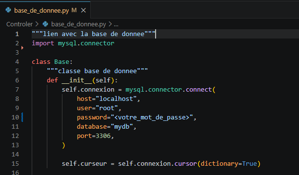
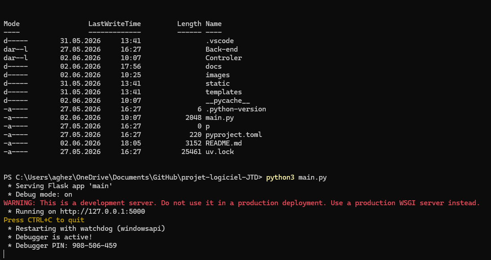

# Journal Tracker To Do : projet-logiciel P2026 (version minimale)
README pour l'installation de l'application de Journal_Tracker_To-Do dans le cadre du cours de Développement Projet Logiciel (UNIL).

# Installation

Création d'un serveur local de MySQL : 
1) Installez MySQL Workbench (https://dev.mysql.com/downloads/installer/).
2) Terminez l'installation en le paramétrant à votre guise 
3) Ouvrez le dossier projet-logiciel-JTD et ouvrez le fichier "base.sql" qui se trouve dans le répertoire "backend".
4) Copiez le contenu de "base.sql" et créez un nouveau modèle dans MySQL (cliquez sur "File" (en haut à gauche) et séléctionnez "New Model").
5) Ouvrez le menu SQL Script (avant-dernier menu déroulant qui se trouve au milieu de la page) et double-cliquez sur "Add Script".
6) Collez le contenu de "base.sql" dans le nouveau script qui vient d'apparaître.
7) Sous l'onglet Forward Engineering (en haut à droite de l'onglet script que vous venez d'ouvrir), changez "Do not include" par "Bottom of script".
8) Cliquez sur l'onglet "Database" (tout en haut à gauche, entre l'onglet "Model" et l'onglet "Tools") et sélectionnez "Reverse Engineer...".
9) Appuyez sur "next" (entrez votre mot de passe si on vous le demande) jusqu'à ce que vous arriviez sur une page qui contient 6 tables (parametres, journal, tracker, calendrier, tache et calendrier_has_tracker).
10) Recliquez sur "Database" et sélectionnez maintenant "Forward Engineer...", appuyez sur "next" jusqu'à ce que vous soyez de retour sur vodre modèle.
11) Revenez sur votre première fenêtre en sélectionnant le premier fichier en haut à gauche (qui devrait s'intituler "MySQL Model*"), vérifiez que l'onglet "Tables" contient maintenant 6 items.
12) Appuyez sur "Database" (en haut à droite) et séléctionnez "Connect to Database", entrez votre mot de passe et souvenez-vous-en puis appuyez sur "ok".
13) Vous pouvez maintenant retourner à l'écran d'accueil (en cliquant sur l'icône "maison" en haut à gauche) et vous devriez y voir, sous "MySQL Connections", un nouveau serveur (qui pourrait par exemple s'appeler "Local instance MySQL80").
14) Vous pouvez désormais fermer MySQL Workbench.

Modification de la connexion à la base : 
1) Ouvrez le dossier  dans un éditeur de code (Visual Studio Code par exemple) et ouvrez le fichier "base_de_donnee.py" qui se trouve dans le dossier "controler".
2) Modifiez les informations de l'"init" de la classe "Base" ("host", "user", "password", "database", "port"), surtout le "password", pour qu'elles corréspondent au serveur que vous venez de créer sur votre machine.
3) N'oubliez pas de sauvegarder et vous pouvez fermer votre éditeur de code.

Lancement de l'application : 
1) Ouvrez un terminal et rendez-vous dans le dossier de l'application.
2) Lancez la commande python3 main.py.
3) Maintenez "ctrl" en cliquant sur le lien qui suit "Running on" (généralement quelque chose comme: "http://127.0.0.1:5000").
4) L'application est lancée !

