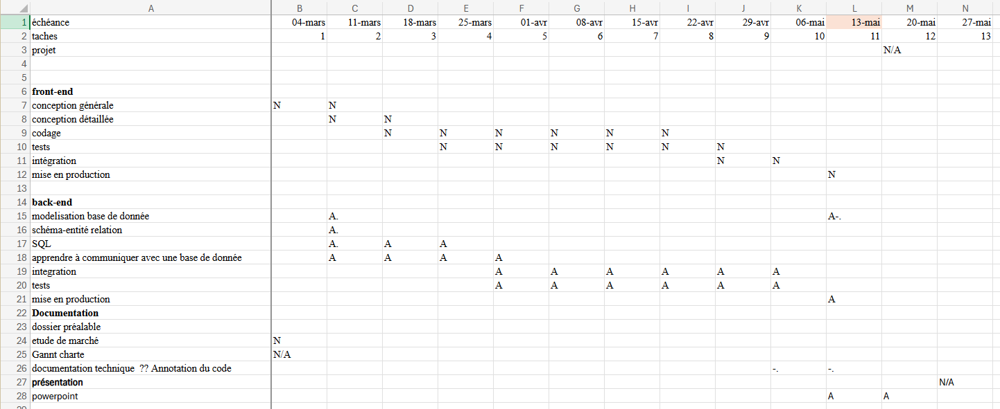
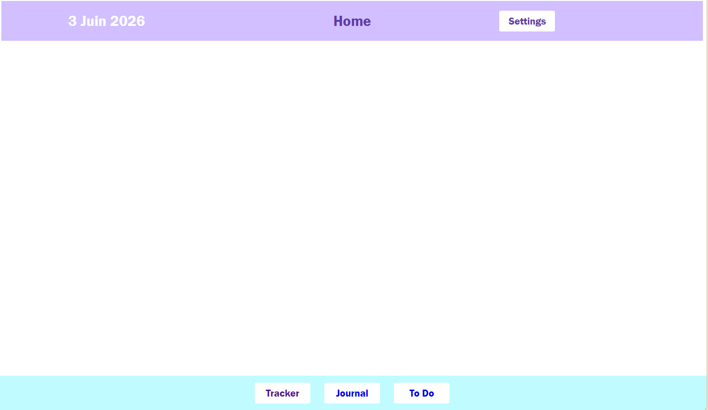
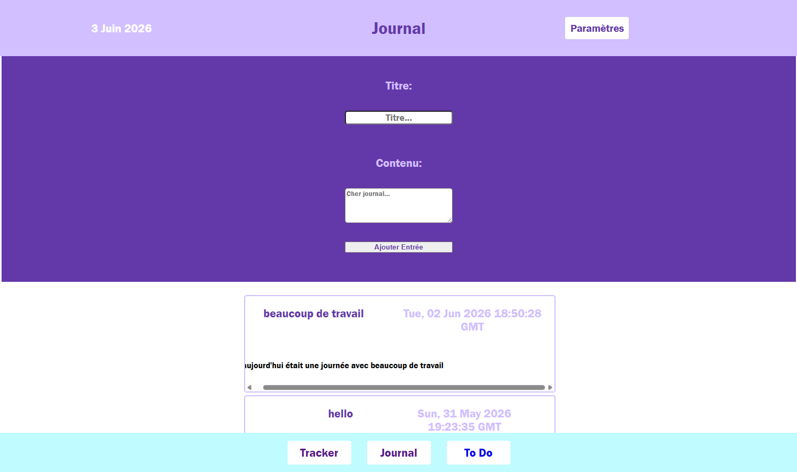
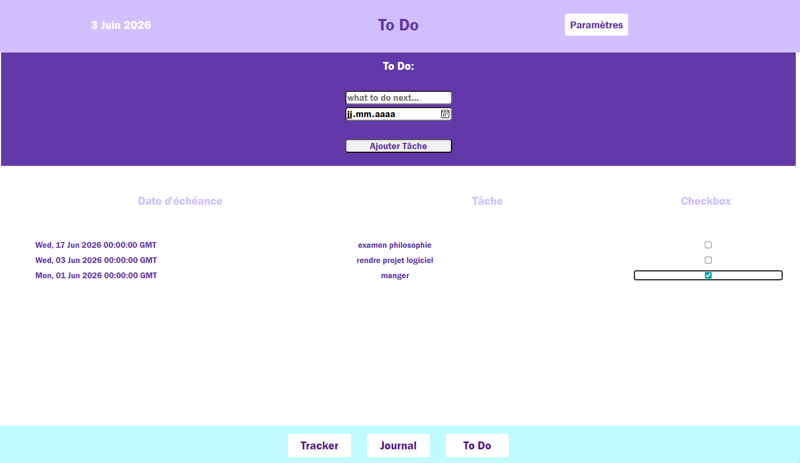
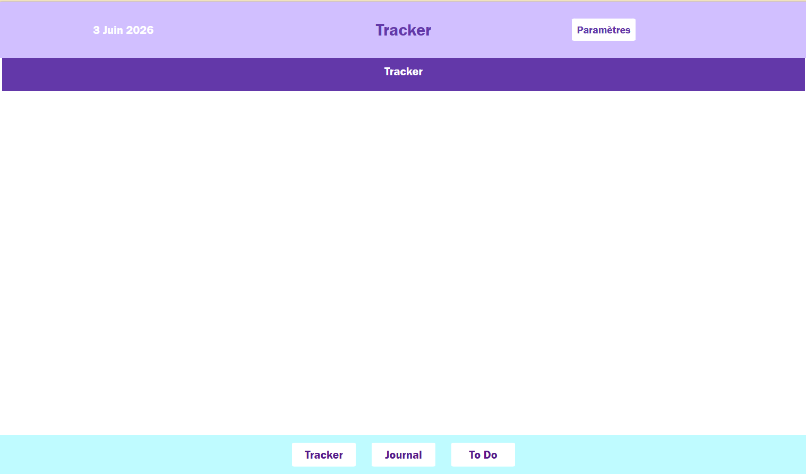
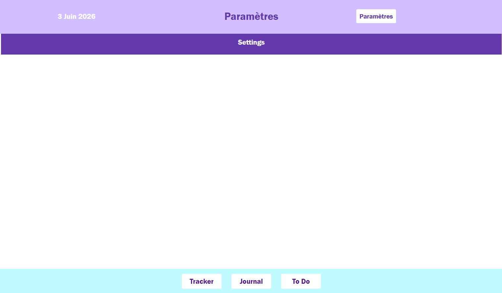

Rapprt du projet logiciel : Journal To-Do Tracker
## Déscription du projet : 
Le but de ce projet était de créer une application tournant en local qui permettait les fonctionnalités suivantes : 
### Journal : 
La fonctionnalité journal devait permettre de pouvoir :
- Ajouter une nouvelle entrée au journal (avec un titre et un contenu).
- Modifier le contenu d'une entrée déja ajoutée (en la séléctionnant pouvoir modifier son contenu).
- Visualiser les entrées ajoutées (leur titre, leur contenu, leur date de création).
### To-Do :
La fonctionnalité To-Do devrait perrmettre de pouvoir : 
- Ajouter une nouvelle tâche (nom de la tâche, date à laquelle elle doit être terminée).
- Modifier le statut d'une tâche (pour le faire passez de "non-faite" à "faite" (ou de "faite" à "non-faite")).
### Tracker : 
La fonctionnalité Tracker dervrait permettre de pouvoir : 
- Ajouter un nouveau Tracker (titre, description, icône, couleur).
- Appliquez un Tracker à un calendrier pour savoir quel jour quel objectif à été rempli.
## Technologies utilisées : 
Les technologies utilisées pour ce projet sont : 
- Visual Studio Code (comme éditeur de code).
- MySQL Workbench 8.0 CE (pour la création de la base de donnée et l'hébergement du serveur de la base).
- Flask (pour l'API, les liens entre la base et le front-end).
- GitHub (pour la collaboration sur le projet)
## Architecture du projet : 
Le projet est organisé en trois séctions principales : le Backend, le Controler et le Frontend. 
### Back-end : 
Le backend s'occupe de tout ce qui se passe en arrière plan, il comprend : 
- La base de donnée, qui tourne sur un serveur MySQL.
- Le script de la base de donnée, qui se trouve dans la dossier "backend" du projet sous le nom de "base.sql".
### Controler : 
Le controler est l'entité qui fait le lien entre le back-end et le front-end, il comprend les fichiers :
- "__init__.py" qui sert à rendre le répertoire lisible par python.
- "base_de _donnee.py" qui instancie la classe "Base" qui possède les méthodes "display", "query" et "commit" qui permettent donner des requetes MySQL à la base. Le __init__ de "Base" permet aussi d'établir le lien avec la base de donnée.
Mais aussi deux répertoires "classe" et "flask" qui sont explicités dans les deux séctions suivantes :
#### Les Classes
Les éléments du répertoire "classe" qui se trouvent dans le repertoire "controler" sont des fichiers python qui définissent une classe pour chaque tableau de la base et qui spécifient les méthodes qui sont propres à chacunes de ces entités, le répertoire "classe" comprend : 
- "__init__.py" qui sert à rendre le répertoire lisible par python.
- ".Journal.py" qui définit la classe "Journal" ainsi que ces méthodes .
    - "nouveau" qui permet de crée une nouvelle entrée au journal et qui prend comme attribut le titre de l'entrée et son contenu.
    - "get_tout" qui permet de retourner tout les éléments du journal.
    - "modifier" qui permet de modifier le contenu d'une entrée et qui prend comme attribut le nouveau contenu de l'entrée ainsi que la date de la modification et l'id de l'entrée à modifiée.
    - "supprimer" qui permet de supprimer une entrée du journal.
- ".Tache.py" qui définit la classe "Tache" ainsi que ces méthodes.
    - "nouveau" qui permet de crée une nouvelle tache et qui prend comme attribut le nom de la tache, sa date buttoire d'execution, son statut et le fait qu'elle possède ou non une sous-tache (les sous-taches n'étant pas fonctionnelle dans cette version de l'application, cet attribut ne sert à rien, mais est déja implémenter dans le back-end, pour qu'il ne reste plus qu'à la crée dans le front-end).
    - "modification_statut" qui sert à valider ou invalider une tâche et qui prend comme attributs l'id de la tache à modifier ainsi que son nouveau statut
    - "modification_date" qui sert à modifier la date buttoire d'une tâche et qui prend comme attributs la date buttoire actuelle, le nom de la tache et sa nouvelle datte butoire.
    - "get_tout" qui permet de retourner toutes les taches.
    - "supprimer" qui permet de supprimer une tache.
    - ".Tache.py" contient aussi la classe "SousTache" qui n'est pas implémentée dans le front-end mais qui continue d'exister dans le back-end en vue d'une future implémentation.
- ".Tracker.py" qui définit la classe "Tracker" ainsi que ces méthodes :
    - "nouveau" qui permet de crée un nouveau tracker et qui prend comme attributs le nom du tracker, sa déscription, sa couleur et son icone.
    - "get_tout" qui permet de récuperer tout les trackers.
- ".calendrier.py" qui définit la classe "Calendrier" ainsi que sa méthode :
    - "creer_jour" qui permet de crée un jour et qui prend comme attribut la date du jour en question.
- "calendrier_has_tracker" qui définit la classe "CalendrierHasTracker" et ses méthodes : 
    - "trouve_tracker_par_jour" qui permet de récuperer tous les trackers pour un jour donné et qui prend comme attribut l'id du calendrier.
    - "activer_tracker" qui permet d'activer un tracker donné pour un jour donné et qui prend comme argument l'id du calendrier et l'id du tracker.
    - "desactiver_tracker" qui permet de desactiver un tracker donné pour un jour donné et qui prend comme argument l'id du calendrier et l'id du tracker.
- ".parametres.py" qui définit la classe "Parametres" et ses methodes :
    - "modifier_affichage" qui permet de modifier l'affichage par défaut et qui prend comme argument la nouvelle valeur de l'affichage .
    - "modifier_couleur" qui permet de modifier la couleur de l'affichage par défaut et qui prend comme argument la nouvelle valeur de la couleur.
    - "get_tout" qui permet de récuperer tout les éléments de Parametres.
#### Les Liens Flasks
Les éléments du répertoire "flask" qui ce trouvent dans le repertoire "controler" sont des fichiers python qui définissent les liens flask qui appelent les méthodes des classes et permettent ainsi de faire le lien entre l'interface utilisateur et la base de donnée. Les fichiers du répertoire "flask" se trouvant dans le répertoire "controler" sont les suivant :
- "__init__.py" qui sert à rendre le répertoire lisible par python.
- "journal_flask.py" qui instancie la classe Journal et crée les routes flasques suivantes :
    - "/journal" :
        - "POST" qui permet d'ajouter une entrée à journal en appelant "journal.nouveau".
        - "GET" qui permet de récuperer toutes les entrées de journal en appelant "journal.get_tout".
    - "/journal/<.int:id_>" :
        - "PUT" qui permet de modifier le contenu d'une entrée en appelant "journal.modifier" et qui prend l'id de l'entrée comme attribut.
        - "DELETE" qui permet de supprimer une entrée en appelant "journal.supprimer" et qui prend l'id de l'entrée comme attribut.
- "tache_flask.py" qui instancie la classe Tache et crée les routes flasques suivantes :
    - "/tache" :
        - "POST" qui permet d'ajouter une nouvelle tache en appelant "tache.nouveau".
        - "GET" qui permet de récuperer toutes les taches en appelant "tache.get_tout".
    - "/tache/<.int:id_>/statut" :
        - "PUT" qui permet de modifier le statut d'une tache en appelant "tache.modification_statut" et qui prend son id en argument.
        - "DELETE" qui permet de supprimer une tahce en appelant "tache.supprimer" et qui prend l'id de l'entrée comme attribut.
    - "/tache_date" : 
        - "PUT" qui permet de modifier la date buttoire d'une tache en appelant "tache.modification_tache" et qui prend comme attribut le nom, l'ancienne date et la nouvelle date butoire de la tache.
    - "tache_flask.py" instancie aussi et posède les liens pour la création et la récuperation de sous-taches qui ne sont pas implémentés dans la version actuelle de l'application.
- "tracker_flask.py" qui instancie les classe Tracker, Calendrier et CalendrierHasTracker et crée les routes flasques suivantes :
    - "/tracker" :
        - "POST" qui permet d'ajouter une un tracker en appelant "tracker.nouveau".
        - "GET" qui permet de récuperer toutes les entrées de tracker en appelant "tracker.get_tout".
    - "/calendrier" :
        - "POST" qui permet d'ajouter un nouveau jour à calendrier en appelant "calendrier.creer_jour".
    - "/calendrier/<.int:calendrier_id>/trackers" :
        - "GET" qui permet de récuperer tout les tracker d'un jour en appelant "calendrier_has_tracker.trouve_tracker_par_jour" et qui prends comme attributs l'id de calendrier.
    - "/calendrier/<.int:calendrier_id>/tracker/<.int:tracker_id>/activer_desactiver :
        - "POST" qui permet de désactiver ou d'activer un tracker pour un jour donné en appelant soit "calendrier_has_tracker.activer_tracker" soit "calendrier_has_tracker.desactiver_tracker" et en prenant comme attributs l'id du calendrier et l'id du tracker.
- "parametre_flask.py" qui instancie la classe Parametres et crée les routes flasques suivantes :
    - "/parametre"
        - "GET" permet de récuperer toutes les données de parametres en appelant "parametre.get_tout".
    - "/parametre_statut" 
        - "PUT" permet de modifier le statut des parametres.
    - "/parametre_couleur" 
        - "PUT" permet de modifier les couleur des parametres.
### Front-End : 
Le frontend s'occupe de tout ce qui se passe en avant plan et permet la visualisation de l'intéractivité de l'utilisateur avec le logiciel. Il comprend : 
- Le fichier "main.py" qui regroupe et importe tous les autres fichiers flask pour les faire interagir avec les pages html. Le fichier correspond à l'application et peut se lancer avec les commandes 
>$env:FLASK_APP="main.py"
>flask run
- Le dossier "templates" qui comprend toutes les pages html du projet. Elles sont structurées de la manière suivante :
    - "index.html" : il contient le header, le footer ainsi qu'un block entre les deux qui permet de générer le contenu de la page sélectionnée. De cette manière le header et le footer n'ont besoin d'être codés qu'une seule fois tout en restant permanent dans l'application.
- Le dossier "static" qui contient deux dossiers :
    - Le dossier "scripts" qui regroupe les script js qui comprennent les fonctions qui font directement le lien avec les méthodes flask correspondantes en plus d'autres fonctionnalités.
    - Le dossier "styles" qui regroupe les pages css qui permettent de customiser visuellement les éléments de la page html correspondante.

## Organisation du projet : 
Le projet a été réalisé du 04.03.26 au 03.06.26. 
### Répartition des tâches : 

Nada Waly : Front-end.
Alyssa Gheza : Back-end et Controler.
## Fonctionnement du logiciel :
Le logiciel est constitué des cinq pages web suivantes : 
### Page d'Accueil :
Au lancement de l'appliquation vous arriverez sur la page "Home" qui sert de page d'accueil. D'ici là vous pouvez vous rendre : 
- Sur la page "Journal" en cliquant sur le bouton "Journal" (en bas au milieux).
- Sur la page "Tracker" en cliquant sur le bouton "Tracker" (en bas à droite).
- Sur la page "To Do" en cliquant sur le bouton "ToDo" (en bas à gauche).
- Sur la page "Settings" en cliquant sur le bouton "Settings" (en haut à droite).

### Page Journal :
En cliquant sur le bouton "Journal" depuis une autre page vous vous rendrez sur la page "Journal", ce qui vous donnera la possibilité de : 
- Ajouter une nouvelle entrée journal en : 
    - Remplissant le champ "Titre..." en cliquant sur le réctangle blanc qui porte ce nom et en y écrivant le titre de votre entrée. 
    - Remplissant le champ "Contenu" en cliquant sur le réctangle blanc qui porte le nom "Cher journal..." et en y écrivant le contenu de votre entrée.
    - Enregistrerant votre entrée en appuyant sur le bouton "Ajouter Entrée". 
- Visualisez vos entrées enregistrées (en faisant défiller la page vers le bas)
- Vous rendre sur les autres pages du logiciel :
    - Sur la page "Journal" en cliquant sur le bouton "Journal" (en bas au milieux).
    - Sur la page "Tracker" en cliquant sur le bouton "Tracker" (en bas à droite).
    - Sur la page "To Do" en cliquant sur le bouton "ToDo" (en bas à gauche).
    - Sur la page "Settings" en cliquant sur le bouton "Paramètres" (en haut à droite).

### Page To Do : 
En cliquant sur le bouton "To Do" depuis une autre page vous vous rendrez sur la page "To Do", ce qui vous donnera la possibilité de : 
- crée une nouvelle tache en : 
    - remplissant le champ "what to do next..." avec le nom de votre tâche à accomplir.
    - séléctionner une date buttoir pour votre tâche avec le champ "jj.mm.aaaa" .
    - cliquant sur le bouton "Ajouter Tâche".
- Visualiser vos tâches enregistrées.
- Valider vos tâches en cochant la case qui se trouve à leur droite.

### Page Tracker : 
En cliquant sur le bouton "Tracker" depuis une autre page vous vous rendrez sur la page "Tracker", ce qui vous donnera la possibilité de : 
- Vous rendre sur les autres pages du logiciel :
    - Sur la page "Journal" en cliquant sur le bouton "Journal" (en bas au milieux).
    - Sur la page "Tracker" en cliquant sur le bouton "Tracker" (en bas à droite).
    - Sur la page "To Do" en cliquant sur le bouton "ToDo" (en bas à gauche).
    - Sur la page "Settings" en cliquant sur le bouton "Paramètres" (en haut à droite).
 
### Page Paramètres : 
En cliquant sur le bouton "Settings" depuis la page "Home" ou en cliquant sur le bouton "Paramètres" depuis une autre page vous vous rendrez sur la page "Paramètres", ce qui vous donnera la possibilité de : 
- Vous rendre sur les autres pages du logiciel :
    - Sur la page "Journal" en cliquant sur le bouton "Journal" (en bas au milieux).
    - Sur la page "Tracker" en cliquant sur le bouton "Tracker" (en bas à droite).
    - Sur la page "To Do" en cliquant sur le bouton "ToDo" (en bas à gauche).
    - Sur la page "Settings" en cliquant sur le bouton "Paramètres" (en haut à droite).

